<!-- tracks: README.md @ sha256:60e60a3d9b407643 -->

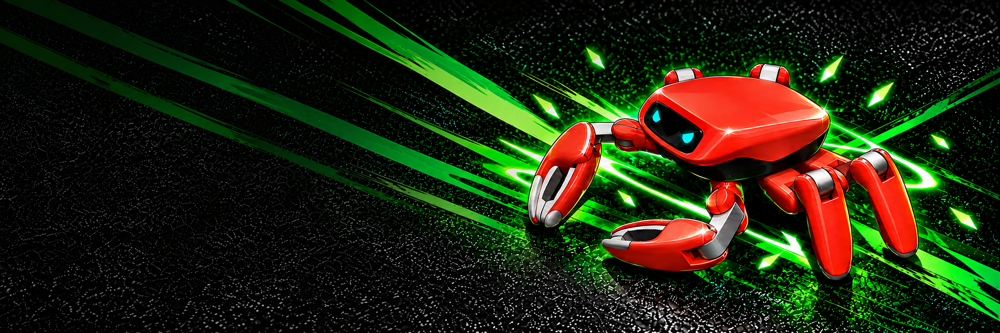

# Jumper

[English](README.md) · [中文](README.zh.md)

为 **Jumper** —— 一台 22 自由度六足机器人 —— 设计外观、训练动作、创造场景。

在 AI 编程助手中打开这个仓库，用一句话描述你的想法，开始创作。
文末列出了相关项目和指南，AI 可以按需读取并使用。

## 一句话，设计外观

> 为 Jumper 设计一个暖沙色游侠外观，统一身体和四肢配色，并导出 `.skin`。

| | | |
|:-:|:-:|:-:|
|  | 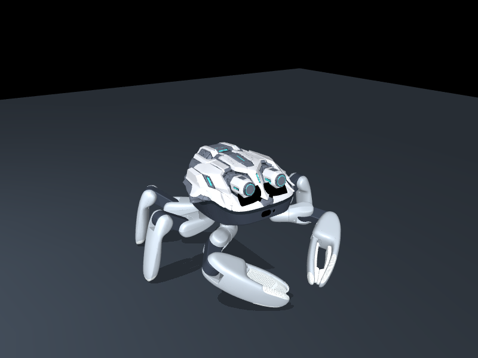 | 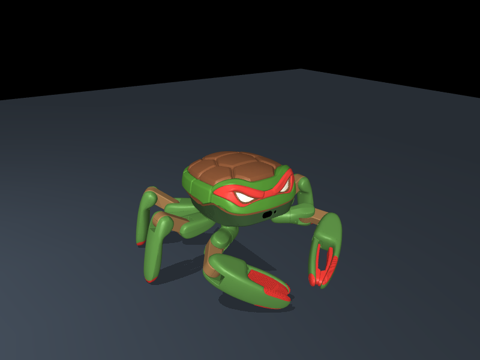 |
| [**暖沙色游侠**](https://github.com/KingKongRobotics/jumper-design/blob/be74e0f2e5e2433d24a3a7b1c1aa0dbeae480356/library/skins/warm-sand-ranger-integrated-v2.skin) | [**银色装甲**](https://github.com/KingKongRobotics/jumper-design/blob/be74e0f2e5e2433d24a3a7b1c1aa0dbeae480356/library/skins/mecha-tripo-v3.skin) | [**Raphael Turtle**](https://github.com/KingKongRobotics/jumper-design/blob/be74e0f2e5e2433d24a3a7b1c1aa0dbeae480356/library/skins/raphael-turtle-v1.skin) |

[浏览全部外观](https://github.com/KingKongRobotics/jumper-design/tree/main/library/skins)

## 一句话，训练动作

> 为 Jumper 训练稳定的三足步态，回放并评估效果，然后打包生成 `.app` 动作包。

| | | |
|:-:|:-:|:-:|
| 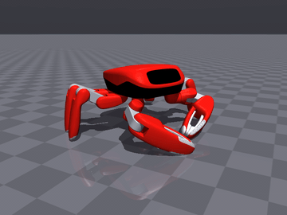 | 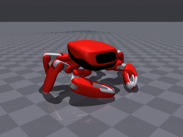 | 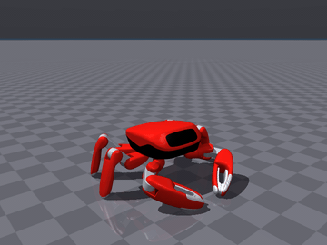 |
| **行走** | **姿态** | **跳跃** |
| 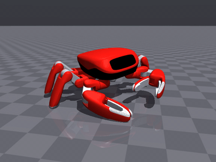 | 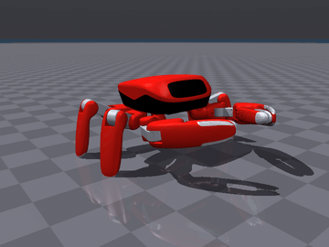 | 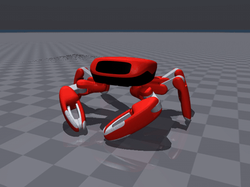 |
| **抓取** | **舞蹈** | **手势** |

## 一句话，生成场景

> 为 Jumper 生成一个有起伏地形、树木和长椅的公园泵道场景，并导出 `.map`。

| | | |
|:-:|:-:|:-:|
| 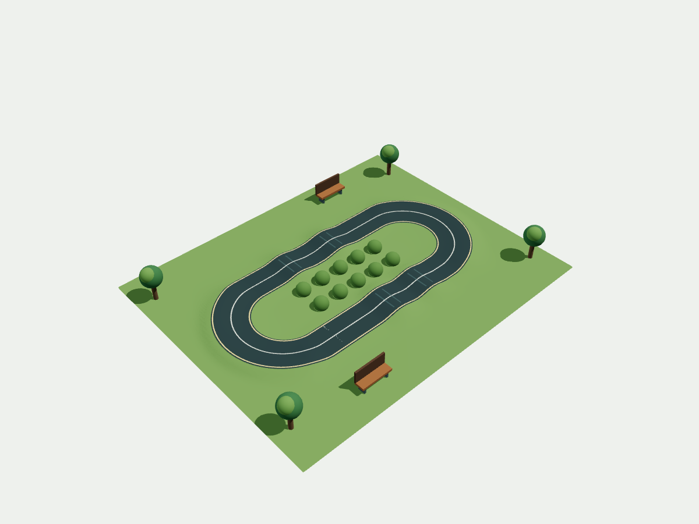 | 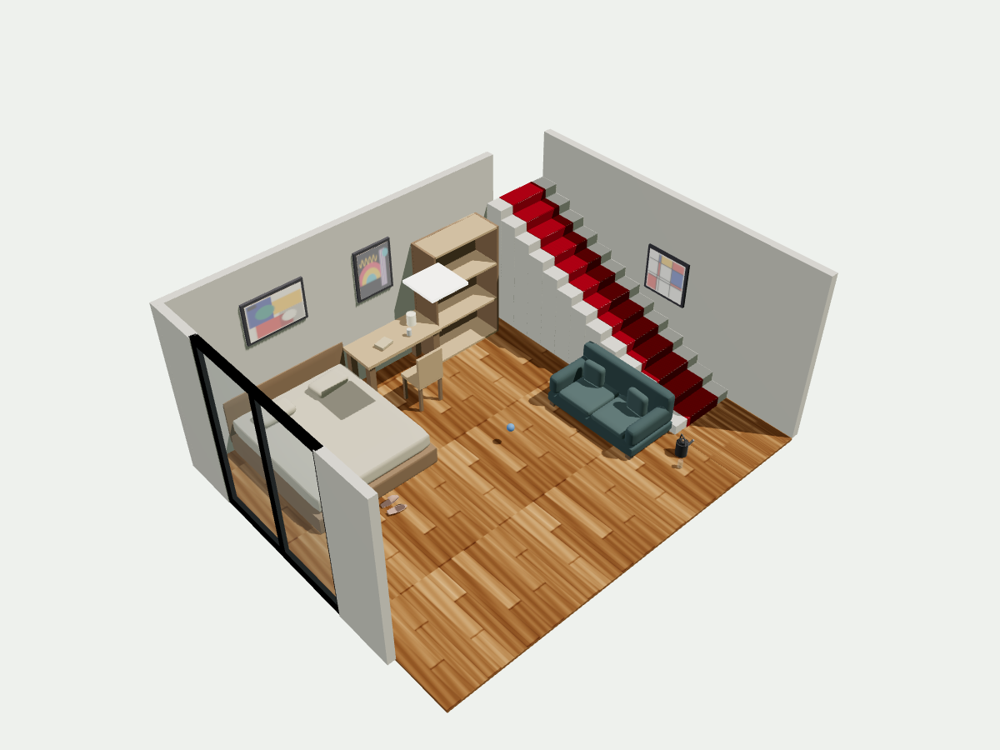 |  |
| [**公园泵道**](https://github.com/KingKongRobotics/jumper-design/blob/be74e0f2e5e2433d24a3a7b1c1aa0dbeae480356/library/maps/park-pump-track.map) | [**卧室**](https://github.com/KingKongRobotics/jumper-design/blob/be74e0f2e5e2433d24a3a7b1c1aa0dbeae480356/library/maps/bedroom.map) | [**足球**](https://github.com/KingKongRobotics/jumper-design/blob/be74e0f2e5e2433d24a3a7b1c1aa0dbeae480356/library/maps/soccer.map) |

[浏览全部场景](https://github.com/KingKongRobotics/jumper-design/tree/main/library/maps)

图片是现有的外观和场景示例；动作片段展示了在仿真中运行的训练策略。

## 相关项目与指南

| | |
|---|---|
| [jumper-design](https://github.com/KingKongRobotics/jumper-design) | 外观与场景生成；AI 读取其[工作说明](https://github.com/KingKongRobotics/jumper-design/blob/main/AGENTS.md)，按需使用工具。 |
| [训练教程](docs/TUTORIAL.zh.md) | 本仓库中的动作训练、回放与策略导出。 |
| [动作包格式](deploy/BUNDLE.md) | 将训练好的动作及控制器打包为 `.app`；环境要求见[构建指南](deploy/README.md)。 |
| [项目指南](docs/PROJECT_GUIDE.zh.md) | 环境安装、当前能力和更多文档。 |

训练基于 [mjlab](https://github.com/mujocolab/mjlab)、
[rsl_rl](https://github.com/leggedrobotics/rsl_rl)、[MuJoCo](https://github.com/google-deepmind/mujoco)
和 [MuJoCo Warp](https://github.com/google-deepmind/mujoco_warp)。
外观与场景示例图片来自 jumper-design，出处见[图片来源](docs/media/DESIGN_SOURCES.md)，
第三方材料归属见 [NOTICE](NOTICE)。

[English](README.md) · [许可证](LICENSE)
